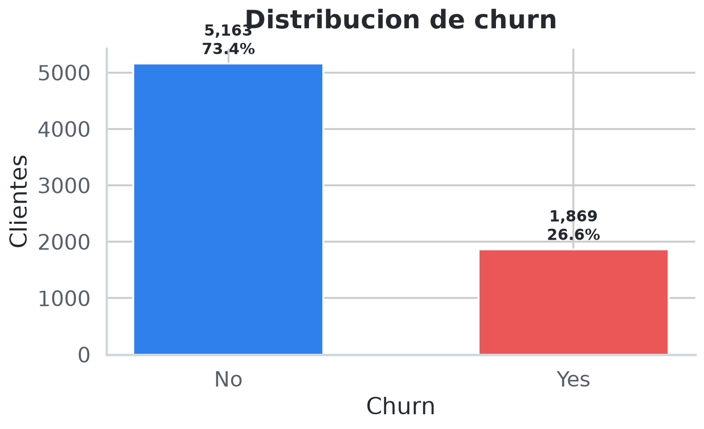
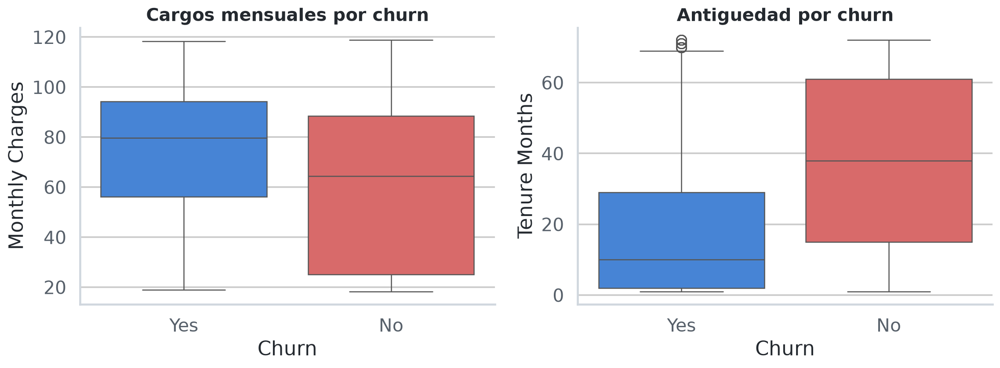
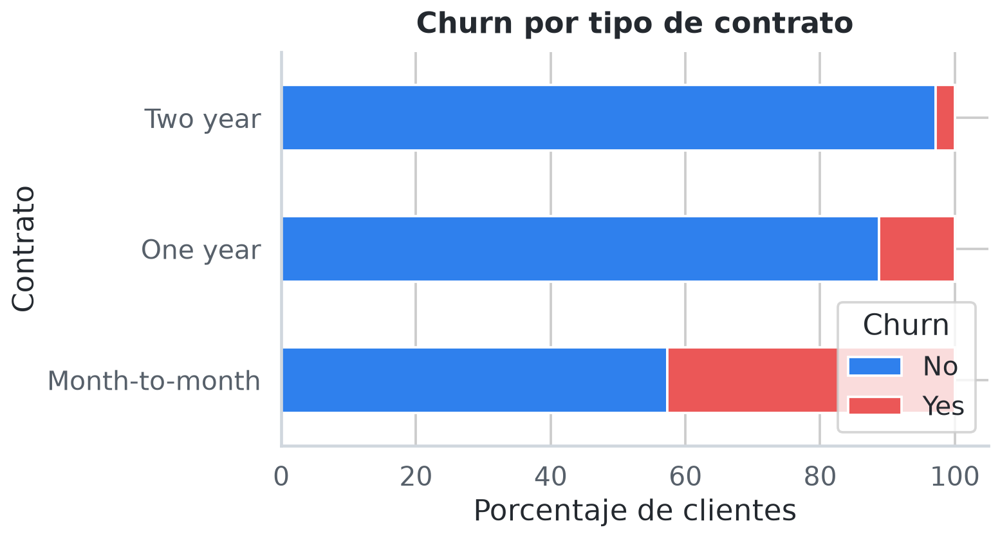
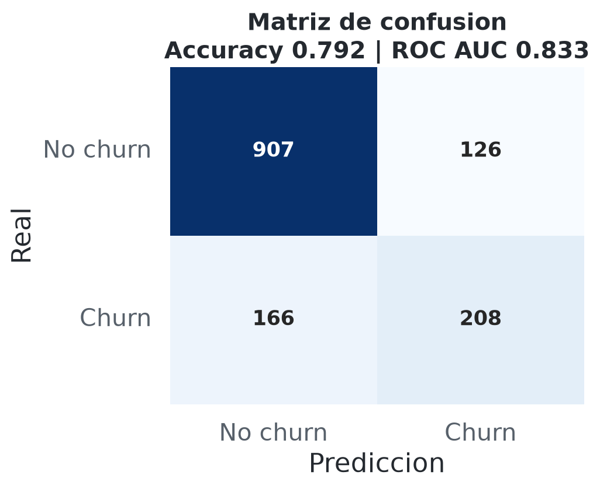

<div align="center">

# Proyecto ML Churn Telco

Pipeline de Machine Learning para analizar, limpiar, modelar y predecir churn de clientes Telco.


</div>

---

## Vista General

Este proyecto analiza el abandono de clientes en un dataset de telecomunicaciones. El flujo completo incluye carga de datos, revision, limpieza, analisis exploratorio, entrenamiento de un modelo base y serializacion del pipeline final.

El notebook corrige errores frecuentes del dataset original, como nombres de columnas con espacios y valores vacios en `Total Charges`, para que el proceso sea reproducible de principio a fin.

## Resultados Clave

| Indicador | Valor |
| --- | ---: |
| Filas originales | 7,043 |
| Filas limpias | 7,032 |
| Columnas originales | 33 |
| Valores vacios en `Total Charges` | 11 |
| Clientes con churn | 1,869 |
| Tasa de churn | 26.58% |
| Accuracy del modelo | 0.792 |
| ROC AUC | 0.833 |

## Graficas

### Distribucion de Churn



### Perfil de Clientes



### Churn por Contrato



### Matriz de Confusion



## Estructura del Proyecto

```text
.
|-- Proyecto_ML_Churn_Abel_Flores.ipynb
|-- Telco_customer_churn.csv
|-- pipeline_churn_telco.pkl
|-- requirements.txt
|-- README.md
|-- assets/
|   |-- churn_distribution.png
|   |-- contract_churn.png
|   |-- confusion_matrix.png
|   `-- customer_profile.png
```

## Archivos Principales

| Archivo | Descripcion |
| --- | --- |
| `Proyecto_ML_Churn_Abel_Flores.ipynb` | Notebook principal con el flujo completo de analisis y modelado. |
| `Telco_customer_churn.csv` | Dataset usado para entrenar y evaluar el pipeline. |
| `pipeline_churn_telco.pkl` | Pipeline entrenado y guardado con `joblib`. |
| `requirements.txt` | Dependencias necesarias para ejecutar el proyecto. |
| `assets/` | Imagenes generadas para documentar resultados y hallazgos. |

## Instalacion

Desde PowerShell:

```powershell
python -m venv .venv
.\.venv\Scripts\python.exe -m pip install -r requirements.txt
```

## Ejecucion

1. Abre `Proyecto_ML_Churn_Abel_Flores.ipynb`.
2. Selecciona el kernel del entorno `.venv`.
3. Ejecuta todas las celdas.
4. Al finalizar, el notebook genera o actualiza `pipeline_churn_telco.pkl`.

Tambien puedes verificar el entorno con:

```powershell
.\.venv\Scripts\python.exe -m pip check
```

## Limpieza de Datos

El dataset original usa nombres de columnas con espacios. Para evitar errores durante el analisis, el notebook crea alias compatibles:

| Columna original | Alias usado |
| --- | --- |
| `Total Charges` | `TotalCharges` |
| `Churn Label` | `Churn` |
| `Churn Value` | `ChurnTarget` |

Tambien se convierten los cargos totales a numerico:

```python
df["TotalCharges"] = pd.to_numeric(df["Total Charges"], errors="coerce")
```

Despues se eliminan los registros con valores faltantes criticos:

```python
df = df.dropna(subset=["TotalCharges", "ChurnTarget"]).copy()
```

## Modelo

El pipeline combina preprocesamiento automatico y regresion logistica:

| Tipo de variable | Transformacion |
| --- | --- |
| Numericas | Imputacion por mediana + escalado estandar |
| Categoricas | Imputacion por moda + One Hot Encoding |
| Modelo | `LogisticRegression(max_iter=1000)` |

El pipeline final se guarda con:

```python
joblib.dump(pipeline, "pipeline_churn_telco.pkl")
```

## Validacion

Estado verificado del proyecto:

- Notebook ejecutado de punta a punta.
- 15 celdas de codigo ejecutadas.
- 0 errores guardados en el notebook.
- `pipeline_churn_telco.pkl` carga correctamente.
- El pipeline genera predicciones sobre datos nuevos con la misma estructura.
- `pip check` no reporta dependencias rotas.

## Hallazgos Rapidos

- Los contratos mes a mes concentran una proporcion mayor de churn.
- Los clientes con menor antiguedad muestran mayor riesgo de abandono.
- Los cargos mensuales tienden a ser mas altos entre clientes que abandonan.
- `Total Charges` requiere limpieza porque contiene 11 valores vacios.

## Autor

**Abel Flores**  
Proyecto de Aprendizaje de Maquina, 5to Cuatrimestre.
